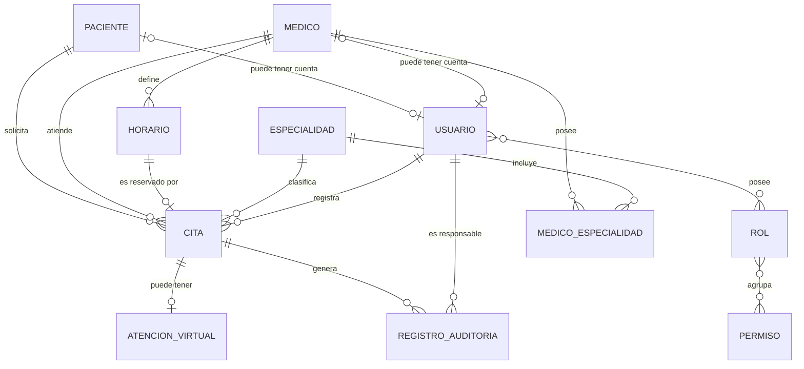

# Diagrama E-R — Sistema de Gestión de Citas y Atención Virtual

**Sistema:** Sistema de Gestión de Citas y Atención Virtual — Hospital Boliviano Español  
**Generado:** Paso 03 — Diagrama E-R  
**Agente utilizado:** `database-engineer`  
**Skill utilizado:** `database-schema-designer`  
**Workflow:** `02_database_workflow`  
**Fuente principal:** `proyecto/base_datos/02_modelo_conceptual/modelo_conceptual.md`  
**Estado:** Corregido manualmente y pendiente de validación humana  

---

## 1. Objetivo del Paso 03

El presente documento representa mediante un diagrama Entidad–Relación las entidades y relaciones conceptuales identificadas y aprobadas previamente en el modelo conceptual del Sistema de Gestión de Citas y Atención Virtual del Hospital Boliviano Español.

Este paso se mantiene en un nivel conceptual.

Por tanto:

- no se generan sentencias SQL;
- no se selecciona un sistema gestor de base de datos;
- no se definen tipos físicos de columnas;
- no se implementan claves foráneas físicas;
- no se crean índices;
- no se definen restricciones específicas de un SGBD;
- no se ejecuta el modelo lógico correspondiente al Paso 04.

---

## 2. Diagrama Entidad–Relación

> **Nota:** `PARAMETROS_CONFIGURACION` forma parte de las entidades conceptuales aprobadas, pero se mantiene como entidad conceptual independiente. No se crea una entidad artificial denominada `SISTEMA` únicamente para relacionarla con los parámetros de configuración.

---

## 3. Entidades conceptuales identificadas

El modelo conceptual contiene **12 entidades de dominio**.

### 3.1 Paciente

Representa la identidad clínica de la persona que solicita atención médica.

Un paciente puede tener múltiples citas a lo largo del tiempo.

El paciente puede existir sin una cuenta de usuario asociada.

---

### 3.2 Médico

Representa la identidad profesional del prestador de atención médica.

Un médico puede:

- pertenecer a una o varias especialidades;
- definir múltiples horarios;
- atender múltiples citas;
- existir sin una cuenta de usuario asociada.

La identidad profesional `MEDICO` permanece separada de la identidad digital `USUARIO`.

---

### 3.3 Usuario

Representa la identidad digital utilizada para autenticación, autorización y acceso al sistema.

Un usuario puede:

- poseer uno o varios roles;
- registrar citas;
- ser responsable de eventos registrados en auditoría;
- estar vinculado a un paciente;
- estar vinculado a un médico.

La existencia de `USUARIO` no sustituye las entidades `PACIENTE` o `MEDICO`.

---

### 3.4 Especialidad

Representa una especialidad médica disponible dentro del sistema.

Una especialidad puede estar asociada a múltiples médicos mediante `MEDICO_ESPECIALIDAD`.

También puede estar asociada a múltiples citas.

La ubicación de la habilitación de modalidad virtual no se define todavía debido a la decisión pendiente D-08.

---

### 3.5 Médico–Especialidad

`MEDICO_ESPECIALIDAD` representa conceptualmente la asociación existente entre médicos y especialidades.

Permite representar que:

- un médico puede pertenecer a varias especialidades;
- una especialidad puede estar asociada a varios médicos;
- cada combinación Médico–Especialidad debe ser única.

Esta entidad asociativa evita duplicar en el diagrama una relación N:M directa entre `MEDICO` y `ESPECIALIDAD`.

---

### 3.6 Horario

Representa un bloque de disponibilidad definido por un médico.

Un médico puede definir varios horarios.

Cada bloque puede encontrarse libre o vinculado como máximo a una cita que mantenga la reserva correspondiente.

La decisión sobre si la modalidad presencial o virtual pertenece al horario continúa pendiente mediante D-09.

---

### 3.7 Cita

Representa la entidad transaccional central del sistema.

Conceptualmente una cita relaciona:

- un paciente;
- un médico;
- una especialidad;
- un horario;
- un usuario registrador;
- y, cuando corresponda, información de atención virtual.

Además, puede generar múltiples registros de auditoría durante su ciclo de vida.

---

### 3.8 Atención virtual

Representa la información complementaria necesaria cuando una cita corresponde a una atención virtual.

Una cita puede:

- no tener información de atención virtual si es presencial;
- tener una única información de atención virtual cuando corresponda.

Los incidentes relacionados con el servicio virtual se mantienen conceptualmente dentro de esta entidad durante el Paso 03.

La decisión de convertir posteriormente dichos incidentes en una entidad independiente se evaluará en el modelo lógico.

---

### 3.9 Registro de auditoría

Representa el historial de modificaciones relevantes realizadas sobre las citas.

Cada registro de auditoría identifica conceptualmente:

- la cita afectada;
- el usuario responsable;
- la acción realizada;
- el valor anterior;
- el valor actualizado;
- la fecha y hora del evento.

Una misma cita puede generar múltiples registros de auditoría.

Un mismo usuario puede ser responsable de múltiples registros.

---

### 3.10 Parámetros de configuración

`PARAMETROS_CONFIGURACION` representa los valores configurables utilizados por diferentes reglas de negocio.

Entre ellos se consideran conceptualmente:

- tiempo mínimo para cancelar una cita;
- tiempo mínimo para reprogramar una cita;
- tolerancia para declarar una cita como no asistida;
- anticipación máxima permitida para realizar una reserva;
- tiempo configurable de inactividad de sesión.

La entidad se mantiene conceptualmente independiente.

No se incorpora una entidad denominada `SISTEMA` únicamente para establecer una relación artificial con estos parámetros.

---

### 3.11 Rol

Representa un rol utilizado para controlar el acceso a las funciones del sistema.

Los roles considerados incluyen conceptualmente:

- paciente;
- médico;
- personal de admisión o recepción;
- administrador.

Un usuario puede poseer varios roles y un mismo rol puede estar asignado a varios usuarios.

---

### 3.12 Permiso

Representa una operación o capacidad autorizada dentro del sistema.

Los permisos se agrupan mediante roles.

Un rol puede contener varios permisos y un permiso puede ser utilizado por diferentes roles.

---

## 4. Cardinalidades principales

| Relación | Cardinalidad | Interpretación |
|---|---|---|
| **Paciente – Cita** | 1:N | Un paciente puede tener varias citas; cada cita corresponde a un paciente |
| **Médico – Cita** | 1:N | Un médico puede atender varias citas; cada cita corresponde a un médico |
| **Médico – Horario** | 1:N | Un médico puede definir múltiples bloques de disponibilidad |
| **Horario – Cita** | 1 : 0..1 | Cada cita utiliza exactamente un horario; un horario puede estar libre o vinculado como máximo a una cita |
| **Especialidad – Cita** | 1:N | Una especialidad puede aparecer en múltiples citas; cada cita corresponde a una especialidad |
| **Cita – Atención virtual** | 1 : 0..1 | Una cita puede no tener información virtual o tener una única información de atención virtual |
| **Cita – Registro de auditoría** | 1:N | Una cita puede generar múltiples registros de auditoría |
| **Usuario – Registro de auditoría** | 1:N | Un usuario puede ser responsable de múltiples registros |
| **Paciente – Usuario** | 0..1 : 0..1 | Un paciente puede existir sin cuenta de usuario y puede vincularse con una cuando corresponda |
| **Médico – Usuario** | 0..1 : 0..1 | Un médico puede existir sin cuenta; cuando existe una cuenta asociada, representa su identidad digital |
| **Usuario – Rol** | N:M | Un usuario puede tener varios roles y un rol puede pertenecer a varios usuarios |
| **Rol – Permiso** | N:M | Un rol agrupa varios permisos y un permiso puede pertenecer a diferentes roles |
| **Usuario – Cita** | 1:N | Un usuario autorizado puede registrar múltiples citas |
| **Médico – Médico–Especialidad** | 1:N | Un médico puede poseer múltiples asociaciones con especialidades |
| **Especialidad – Médico–Especialidad** | 1:N | Una especialidad puede contener múltiples asociaciones con médicos |

---

## 5. Relación Horario–Cita

La relación entre `HORARIO` y `CITA` constituye una de las reglas centrales del modelo.

Se establece conceptualmente que:

- cada cita debe utilizar exactamente un horario;
- un horario puede permanecer libre;
- un horario puede estar asociado como máximo a una cita que mantenga una reserva activa;
- dos citas incompatibles no pueden ocupar simultáneamente el mismo bloque;
- antes de confirmar una reserva debe verificarse la disponibilidad;
- la verificación y confirmación de la reserva deben realizarse de manera atómica.

La forma concreta de implementar técnicamente esta protección se definirá en las etapas posteriores del diseño de base de datos.

---

## 6. Coherencia Médico–Especialidad–Cita

Toda cita debe registrarse utilizando una especialidad que se encuentre asociada al médico seleccionado.

La asociación válida entre médico y especialidad se representa mediante:

`MEDICO_ESPECIALIDAD`

Por lo tanto, conceptualmente no debe permitirse una combinación:

`CITA → MEDICO + ESPECIALIDAD`

cuando dicha combinación no exista previamente en `MEDICO_ESPECIALIDAD`.

Esta regla garantiza la coherencia entre el profesional que atenderá al paciente y la especialidad bajo la cual fue registrada la cita.

El mecanismo técnico utilizado para implementar esta validación se determinará en etapas posteriores.

---

## 7. Relación Médico–Especialidad

La relación muchos-a-muchos entre médicos y especialidades se representa mediante la entidad asociativa:

`MEDICO_ESPECIALIDAD`

Conceptualmente:

- un médico puede estar asociado a varias especialidades;
- una especialidad puede estar asociada a varios médicos;
- cada asociación Médico–Especialidad debe ser única;
- cada médico debe estar asociado al menos a una especialidad activa, según las reglas de negocio aprobadas.

Por esta razón no se representa simultáneamente otra relación N:M directa entre `MEDICO` y `ESPECIALIDAD`.

---

## 8. Usuario, Paciente y Médico

El modelo mantiene separadas las identidades clínicas, profesionales y digitales.

### Paciente y Usuario

`PACIENTE` representa la identidad clínica.

`USUARIO` representa la identidad utilizada para ingresar al sistema.

Por lo tanto:

- un paciente puede existir sin una cuenta de usuario;
- cuando el paciente dispone de cuenta, se establece el vínculo correspondiente;
- el paciente autenticado únicamente puede gestionar las citas que le corresponden.

### Médico y Usuario

`MEDICO` representa la identidad profesional.

`USUARIO` representa la identidad digital.

Por lo tanto:

- un médico puede existir sin una cuenta de usuario;
- un usuario asociado a un médico permite que ese profesional acceda a las funciones autorizadas;
- la desactivación de una cuenta no implica eliminar la información profesional del médico.

---

## 9. Usuario, Rol y Permiso

La autorización del sistema se representa conceptualmente mediante:

`USUARIO` N:M `ROL`

y:

`ROL` N:M `PERMISO`

Esto permite que:

- un usuario pueda poseer varios roles;
- un mismo rol pueda ser utilizado por varios usuarios;
- un rol pueda contener múltiples permisos;
- un permiso pueda formar parte de varios roles.

Los permisos específicos del personal de admisión continúan sujetos a la decisión pendiente correspondiente.

---

## 10. Usuario registrador de la cita

La relación:

`USUARIO` 1:N `CITA`

representa al usuario que registra inicialmente una cita.

Un usuario autorizado puede registrar múltiples citas.

Esta relación no significa que el mismo usuario sea necesariamente responsable de todas las modificaciones posteriores de la cita.

Las acciones posteriores, como:

- reprogramación;
- cancelación;
- modificación;
- cambios relevantes de estado;

se identifican mediante `REGISTRO_AUDITORIA`, permitiendo registrar para cada evento al usuario responsable correspondiente.

---

## 11. Auditoría

Una cita puede experimentar múltiples modificaciones durante su ciclo de vida.

Por ello:

`CITA` 1:N `REGISTRO_AUDITORIA`

y:

`USUARIO` 1:N `REGISTRO_AUDITORIA`

Cada evento de auditoría debe poder identificar conceptualmente:

- la cita modificada;
- el usuario responsable;
- la acción ejecutada;
- la información anterior;
- la información posterior;
- la fecha y hora del evento.

Esto permite que diferentes usuarios puedan realizar distintas operaciones sobre una misma cita manteniendo trazabilidad histórica.

---

## 12. Atención virtual

`ATENCION_VIRTUAL` mantiene una relación opcional con `CITA`.

Conceptualmente:

- una cita presencial no necesita información de acceso virtual;
- una cita virtual debe disponer de la información necesaria para ingresar al servicio externo;
- una cita puede tener como máximo un conjunto de información de atención virtual.

La eventual normalización de incidentes de atención virtual será evaluada posteriormente.

---

## 13. Parámetros de configuración

`PARAMETROS_CONFIGURACION` se mantiene como entidad conceptual independiente.

Los parámetros permitirán representar reglas cuyo valor debe poder modificarse sin alterar la lógica principal de la aplicación.

Entre ellos se encuentran:

- anticipación máxima para reservar;
- tiempo mínimo para cancelar;
- tiempo mínimo para reprogramar;
- tolerancia para declarar no asistencia;
- tiempo de inactividad de sesión.

En este Paso 03 no se determina su estructura lógica ni física.

---

## 14. Decisiones pendientes

### D-08 — Nivel de habilitación de modalidad virtual

Continúa pendiente definir dónde se establecerá la habilitación de modalidad virtual.

Las posibilidades identificadas incluyen:

- Médico;
- Especialidad;
- Médico–Especialidad;
- Horario;
- combinación de las anteriores.

El diagrama no decide todavía en qué entidad se almacenará dicha habilitación.

---

### D-09 — Modalidad asociada al horario

Continúa pendiente establecer si la modalidad de atención pertenece directamente al bloque `HORARIO`.

Por tanto, en este paso no se determina todavía:

- si un horario será exclusivamente presencial;
- si será exclusivamente virtual;
- si existirán horarios mixtos;
- o si la modalidad permanecerá únicamente relacionada con la cita.

Estas decisiones deben mantenerse abiertas hasta contar con aprobación humana.

---

## 15. Restricciones conceptuales relevantes

### Integridad de la cita

Toda cita debe relacionarse obligatoriamente con:

- un paciente;
- un médico;
- una especialidad;
- un horario.

### Disponibilidad

Una cita únicamente puede reservarse sobre un horario disponible perteneciente al médico seleccionado.

### Doble reserva

No debe existir más de una reserva incompatible sobre el mismo bloque de disponibilidad.

### Superposición del paciente

Un paciente no debe mantener simultáneamente citas cuyos intervalos de atención se superpongan.

### Médico y especialidad

La especialidad seleccionada en la cita debe encontrarse asociada al médico mediante `MEDICO_ESPECIALIDAD`.

### Atención virtual

Una cita virtual debe contar con la información necesaria para acceder al servicio externo.

Una cita presencial no necesita dicha información.

### Auditoría

Las modificaciones relevantes de las citas deben quedar registradas junto con el usuario responsable.

### Conservación

Las citas finalizadas, canceladas y no asistidas deben conservarse de acuerdo con el período establecido en los requisitos.

Los registros de auditoría asociados también deben conservarse.

### Desactivación

La desactivación de un médico o de una cuenta de usuario no debe eliminar las citas históricas ni los registros de auditoría relacionados.

---

## 16. Observabilidad técnica

La observabilidad técnica correspondiente a RNF-17 se mantiene separada de la auditoría funcional.

Incluye conceptualmente eventos como:

- errores de aplicación;
- intentos fallidos de autenticación;
- fallas de operaciones críticas;
- errores de integración;
- eventos técnicos relevantes.

`OBSERVABILIDAD` no se incorpora como entidad de dominio en este diagrama.

Su mecanismo concreto de persistencia se analizará posteriormente.

---

## 17. Entidad Sistema

No se modela una entidad denominada `SISTEMA`.

El sistema representa el contexto global de la solución, no una entidad de negocio que necesite persistencia propia.

Por tanto, tampoco se utilizan relaciones artificiales como:

`SISTEMA → PARAMETROS_CONFIGURACION`

o:

`SISTEMA → OBSERVABILIDAD`

en el modelo E-R conceptual.

---

## 18. Elementos deliberadamente no definidos

Durante el Paso 03 no se establecen:

- tipos físicos de datos;
- `INT`;
- `VARCHAR`;
- `DATE`;
- `TIMESTAMP`;
- `BOOLEAN`;
- claves primarias físicas;
- claves foráneas físicas;
- índices;
- restricciones `UNIQUE`;
- restricciones `NOT NULL`;
- valores `DEFAULT`;
- sentencias `CHECK`;
- triggers;
- procedimientos almacenados;
- mecanismos concretos de bloqueo;
- nivel de aislamiento;
- motor de base de datos.

Estos elementos serán tratados únicamente cuando corresponda según el workflow.

---

## 19. Trazabilidad principal

| Elemento conceptual | Requisitos / decisiones relacionadas |
|---|---|
| Paciente | RF-01, RF-14, RF-15, RN-14 |
| Médico | RF-02, RF-07, RF-16, RN-15, RN-33, RN-34 |
| Usuario | RF-21, RNF-04, RNF-05, RNF-06 |
| Especialidad | RF-03, RF-04, RF-06 |
| Médico–Especialidad | RF-04, RN-02 |
| Horario | RF-05, RF-08, RF-17, RN-03, RN-10 |
| Cita | RF-09..RF-18, RF-20, RN-01..RN-22 |
| Atención virtual | RF-18, RF-19, RN-18, RN-19, RN-29, RN-30 |
| Registro de auditoría | RF-22, RN-23, RN-24, RN-25 |
| Parámetros de configuración | RN-26, RN-27, RN-28 |
| Rol | RF-21, RNF-05 |
| Permiso | RF-21, RNF-05 |
| Concurrencia | RNF-11, D-21 |
| Observabilidad técnica | RNF-17 |
| Conservación histórica | RNF-18, D-20 |
| Modalidad virtual | D-08, D-09 |

---

## 20. Resultado del Paso 03

El Paso 03 representa mediante un diagrama E-R las entidades y relaciones derivadas del modelo conceptual aprobado.

Se mantienen **12 entidades conceptuales de dominio**:

1. Paciente
2. Médico
3. Usuario
4. Especialidad
5. Médico–Especialidad
6. Horario
7. Cita
8. Atención virtual
9. Registro de auditoría
10. Parámetros de configuración
11. Rol
12. Permiso

`Observabilidad técnica` permanece como concepto técnico independiente y no como entidad de dominio.

`Sistema` tampoco se modela como entidad.

El diagrama conserva abiertas las decisiones D-08 y D-09.

No se genera SQL.

No se selecciona un SGBD.

No se ejecuta el modelo lógico.

---

## 21. Checkpoint del Paso 03

**Agente utilizado:** `database-engineer`  
**Skill utilizado:** `database-schema-designer`  

**Archivo generado:**

`proyecto/base_datos/02_modelo_conceptual/diagrama_er.md`

**Paso completado:**

`Paso 03 — Diagrama E-R`

**Siguiente paso:**

`Paso 04 — Modelo lógico`

**Estado del checkpoint:**

Paso 03 completado y pendiente de validación humana.

**Importante:** La finalización de este artefacto no autoriza la ejecución automática del Paso 04. Se requiere aprobación humana explícita antes de continuar.