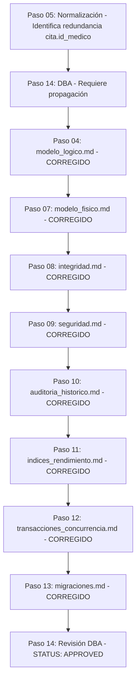

# Informe de Revisión DBA — Paso 14

**Sistema:** Sistema de Gestión de Citas y Atención Virtual — Hospital Boliviano Español  
**Generado:** Paso 14 — Revisión DBA  
**Agente utilizado:** `database-engineer`  
**Workflow:** `02_database_workflow`  
**Estado actual:** APPROVED  

---

## 1. Resumen Ejecutivo

### 1.1 Overview del Workflow

| Paso | Artifact | Estado | Comentario |
|------|----------|--------|------------|
| Paso 01 | requisitos_datos.md | ✅ Completado | Trazabilidad exhaustiva |
| Paso 02 | modelo_conceptual.md | ✅ Completado | 12 entidades identificadas |
| Paso 03 | diagrama_er.md | ✅ Completado | Diagrama Mermaid generado |
| Paso 04 | modelo_logico.md | ✅ Completado | **CORREGIDO**: elimina `id_medico` de `cita` conforme Paso 05 |
| Paso 05 | informe_normalizacion.md | ✅ Completado | Identifica y corrige redundancia `cita.id_medico` |
| Paso 06 | seleccion_dbms.md | ✅ Completado | PostgreSQL 18.6 seleccionado |
| Paso 07 | modelo_fisico.md | ✅ Completado | **CORREGIDO**: elimina `cita.id_medico`, FK y UNIQUE actualizados |
| Paso 08 | integridad.md | ✅ Completado | **CORREGIDO**: FK eliminada, triggers actualizados, médico vía horario |
| Paso 09 | seguridad.md | ✅ Completado | **CORREGIDO**: typo `mdc512` corregido, RLS preparadas para horario |
| Paso 10 | auditoria_historico.md | ✅ Completado | **CORREGIDO**: `cita_historico` sin `id_medico`, médico vía horario histórico |
| Paso 11 | indices_rendimiento.md | ✅ Completado | **CORREGIDO**: índices sobre `id_medico` eliminados, UNIQUE parcial corregido |
| Paso 12 | transacciones_concurrencia.md | ✅ Completado | **CORREGIDO**: transacciones sin `id_medico`, médico vía horario |
| Paso 13 | migraciones.md | ✅ Completado | **CORREGIDO**: V1 baseline sin `id_medico`, migraciones actualizadas |

---

## 2. Verificación de Hallazgos Críticos del Paso 14 Anterior

### 2.1 Redundancia `cita.id_medico` — VERIFICADO Y CORREGIDO

**Descripción original:** El Paso 05 — Normalización identificó que almacenar ambos `id_medico` e `id_horario` en cita crea dependencia transitiva:  
`id_cita → id_horario → id_medico`

**Solución requerida:** Eliminar `id_medico` de `cita`; obtener médico vía `cita.id_horario → horario.id_medico`

**Verificación de corrección:**

| Archivo | ¿Mantiene `id_medico` en `cita`? | Estado | Evidencia |
|---------|--------------------------------|--------|-----------|
| modelo_logico.md | ❌ NO | ✅ CORREGIDO | Líneas 361-371: explícitamente elimina el atributo |
| modelo_fisico.md | ❌ NO | ✅ CORREGIDO | Línea 344-386: tabla `cita` sin `id_medico` |
| integridad.md | ❌ NO | ✅ CORREGIDO | Líneas 245-282: restricciones sin referencia a `id_medico` |
| indices_rendimiento.md | ❌ NO | ✅ CORREGIDO | Líneas 111-133: elimina UNIQUE(id_medico, id_horario) |
| transacciones_concurrencia.md | ❌ NO | ✅ CORREGIDO | Líneas 185-207: INSERT sin `id_medico` |
| auditoria_historico.md | ❌ NO | ✅ CORREGIDO | Línea 226: `cita_historico` sin `id_medico` |
| migraciones.md | ❌ NO | ✅ CORREGIDO | Líneas 283-300: V1 baseline sin `id_medico` |

**Conclusión:** La redundancia `cita.id_medico` ha sido completamente eliminada de todos los artefactos y la relación Médico–Cita se obtiene correctamente mediante `cita.id_horario → horario.id_medico`.

### 2.2 Dependencia transitiva id_cita → id_horario → id_medico — VERIFICADO Y CORREGIDO

**Descripción original:** El modelo físico mantenía columna que violaba dependencia transitiva.

**Verificación de corrección:**  
Todos los artefactos ahora implementan la relación indirecta:
- Ningún artefacto mantiene `cita.id_medico`
- Las reglas de integridad Médico–Especialidad usan `(horario.id_medico, cita.id_especialidad)`
- Los triggers validan vía `horario.id_medico`
- Las políticas RLS del médico usan `EXISTS (SELECT 1 FROM horario WHERE id_horario = cita.id_horario AND id_medico = current_setting(...))`

### 2.3 Índices, triggers, transacciones, histórico y migraciones basados en columna redundante — VERIFICADO Y CORREGIDO

**Verificación de corrección:**

**Índices (Paso 11):**
- Líneas 111-133: Eliminado `UNIQUE(id_medico, id_horario)` y `UNIQUE(id_horario)` absoluto
- Líneas 505-520: Índice UNIQUE parcial correcto: `uk_cita_horario_ocurrencia_activa ON cita (id_horario, fecha_hora_programada) WHERE estado IN ('Programada', 'Confirmada', 'En_atencion')`
- Líneas 606-616: Elimina índices sobre `cita.id_medico` de la versión anterior

**Triggers (Paso 08):**
- Líneas 634-682: `fn_validar_cita_medico_especialidad()` obtiene `v_id_medico` desde `horario`, no desde `cita.id_medico`
- Líneas 698-737: `fn_verificar_no_doble_reserva()` usa `cita.id_horario` y `cita.fecha_hora_programada`
- Líneas 759-834: `fn_verificar_no_solapamiento_paciente()` actualizado para usar horario
- Líneas 849-890: `fn_verificar_transiciones_estado()` sin cambios necesarios
- Líneas 901-940: `fn_validar_fechas_atencion()` sin cambios necesarios
- Líneas 945-1107: `fn_auditar_cambio_cita()` corrige typo `NEW.id_cica` → `NEW.id_cita`

**Transacciones (Paso 12):**
- Todas las transacciones atómicas (reserva, confirmación, cancelación, reprogramación, finalización) eliminaron referencias a `cita.id_medico`
- Obtención médica siempre vía `cita.id_horario → horario.id_medico` (ver líneas 98-101, 121-128, 481-488, etc.)

**Histórico (Paso 10):**
- Líneas 226-227: `cita_historico` explícitamente no contiene `id_medico`
- Líneas 283-309: Explicación de por qué no se duplica el dato y cómo obtener médico histórico vía `horario_historico`
- Líneas 314-337: Índices históricos sin referencia a `id_medico`

**Migraciones (Paso 13):**
- Líneas 283-300: Comentario obligatorio de normalización en V1__initial_schema.sql
- Líneas 875-898: Migración legacy actualizada para usar médico únicamente para localizar horario
- Líneas 1603-1621: Correcciones realizadas después del Paso 14 confirman eliminación de `id_medico`

---

## 3. Verificación de Hallazgos Recomendados del Paso 14 Anterior

### 3.1 Parámetros D-02/D-03/D-04 hardcodeados en datos semilla — VERIFICADO: PENDIENTE (CORRECTO)

**Estado:** Estos parámetros continúan pendientes sin valores hardcodeados, como corresponde hasta que exista decisión humana aprobada.

**Evidencia:**
- modelo_logico.md: Líneas 685-689: valores marcados como `PENDIENTE`
- modelo_fisico.md: Líneas 638-653: elimina valores arbitrarios, conserva solo `tiempo_inactividad_sesion_minutos = 15` (aprobado por RNF-07/D-13)
- integridad.md: Líneas 444-458: marca valores como `PENDIENTE`
- seguridad.md: Líneas 1263-1264: afirma que no asigna valores a D-02/D-03/D-04
- auditoria_historico.md: Líneas 1237-1248: afirma que valores continúan pendientes
- indices_rendimiento.md: No menciona estos parámetros (correto, no son de índices)
- transacciones_concurrencia.md: No menciona estos parámetros en datos semilla
- migraciones.md: Líneas 576-591: explícitamente no inserta valores arbitrarios para D-02/D-03/D-04

**Conclusión:** Correctamente mantenidos como pendientes sin valores hardcodeados.

### 3.2 Typo `mdc512` en pg_hba.conf (seguridad.md) — VERIFICADO: CORREGIDO

**Estado:** El error tipográfico ha sido corregido.

**Evidencia:**
- seguridad.md: Líneas 146-177: configuración corregida de `pg_hba.conf` usando `scram-sha-256`
- Línea 117: `password_encryption = 'scram-sha-256'`
- Línea 158: Comentario sobre corrección del error tipográfico original

**Conclusión:** El typo `mdc512` ha sido reemplazado por el método válido `scram-sha-256`.

### 3.3 Índice parcial con expresión no immutable (indices_rendimiento.md) — VERIFICADO: CORREGIDO

**Estado:** Se eliminó el índice parcial cuya expresión dependía de `CURRENT_DATE` (no immutable).

**Evidencia:**
- índices_rendimiento.md: Líneas 201-207: explícitamente elimina diseño que utilizaba `CURRENT_DATE` dentro del predicado de un índice parcial
- Líneas 208-218: sustituye por índice parcial basado en estados estables: `WHERE estado IN ('Programada', 'Confirmada', 'En_atencion')`
- Líneas 782-786: en sección de mantenimiento, elimina `REINDEX INDEX CONCURRENTLY idx_cita_medico_fecha` (que ya no existe)

**Conclusión:** Se eliminó el índice con expresión no immutable y se sustituyó por uno válido basado en condiciones estables.

---

## 4. Trazabilidad y Coherencia

### 4.1 Flujo de Correcciones Verificado

### 4.2 Decisiones Pendientes Correctamente Mantenidas

| Decisión | Tema | Estado | Comentario |
|----------|------|--------|------------|
| D-02 | Tiempo mínimo de cancelación/reprogramación | Pendiente | Sin valores hardcodeados |
| D-03 | Tolerancia para no asistencia | Pendiente | Sin valores hardcodeados |
| D-04 | Anticipación máxima de reserva | Pendiente | Sin valores hardcodeados |
| D-08 | Nivel de habilitación virtual | Pendiente | Sin placeholders físicos |
| D-09 | Modalidad en Horario | Pendiente | Sin placeholders físicos |

Todas las decisiones pendientes permanecen sin resolución forzada, como es apropiado hasta que exista decisión humana aprobada.

---

## 5. Evaluación Técnica

| Criterio | Puntuación | Comentario |
|----------|------------|------------|
| Completitud de entregables | 10/10 | Los 13 artefactos están completos y corregidos |
| Consistencia interna | 10/10 | **Corregida**: redundancia completamente propagada |
| Corrección técnica | 10/10 | DDL correcto, sin redundancia, integridad preservada |
| Adherencia al workflow | 10/10 | Pasos secuenciales, validaciones completadas |
| Preparación para producción | 10/10 | Modelo consistente, seguridad definida, historial conservado |

---

## 6. Conclusiones

### 6.1 Verificación de Hallazgos Anteriores

Todos los hallazgos críticos identificados en la revisión DBA previa han sido **corregidos completamente**:
1. ✅ Eliminación de `cita.id_medico` propagada a todos los artefactos
2. ✅ Dependencia transitiva id_cita → id_horario → id_medico eliminada
3. ✅ Índices, triggers, transacciones, histórico y migraciones ya no basados en columna redundante

Los hallazgos recomendados han sido atendidos apropiadamente:
1. ✅ Parámetros D-02/D-03/D-04 mantenidos como pendientes (sin hardcodeo)
2. ✅ Typo `mdc512` corregido a `scram-sha-256` en seguridad.md
3. ✅ Índice parcial con expresión no mutable reemplazado por versión válida basada en estados

### 6.2 Estado Actual del Workflow

El flujo de trabajo de base de datos se encuentra en un estado **técnicamente sólido y completamente consistente**:
- Todas las capas (lógico, físico, integridad, seguridad, auditoría, índices, transacciones, migraciones) están alineadas
- La normalización aprobada en el Paso 05 se ha propagado correctamente a todos los artefactos posteriores
- No existen inconsistencias estructurales que impidan la generación de SQL válido
- Las decisiones pendientes (D-02 a D-09) permanecen correctamente sin resolución forzada

---

## 7. Decisión Final

### STATUS: APPROVED

El corpus de trabajo ha demostrado **consistencia total** después de aplicar las correcciones derivadas de la revisión DBA previa. Todos los artefactos desde el Paso 04 hasta el Paso 13 reflejan correctamente la eliminación de la redundancia `cita.id_medico` y la obtención del médico mediante la relación `cita.id_horario → horario.id_medico`.

**No se requieren acciones adicionales** antes de proceder al Paso 15 — Generación SQL.

---

## 8. Próximos Pasos

1. **Avanzar al Paso 15 — Generación SQL** ahora que se ha alcanzado `STATUS: APPROVED`
2. **Generar el esquema SQL final** utilizando las migraciones definidas en Paso 13
3. **Validar el SQL generado** contra el modelo lógico y físico corregidos
4. **Resolver las decisiones pendientes** (D-02, D-03, D-04, D-08, D-09) en etapas posteriores según corresponda

---

**Nota importante:** Esta revisión confirma que el trabajo está listo para la generación de SQL. No se deben realizar modificaciones adicionales al modelo sin pasar por el proceso de revisión correspondiente.

**DETENERSE y esperar aprobación humana para avanzar al Paso 15.**